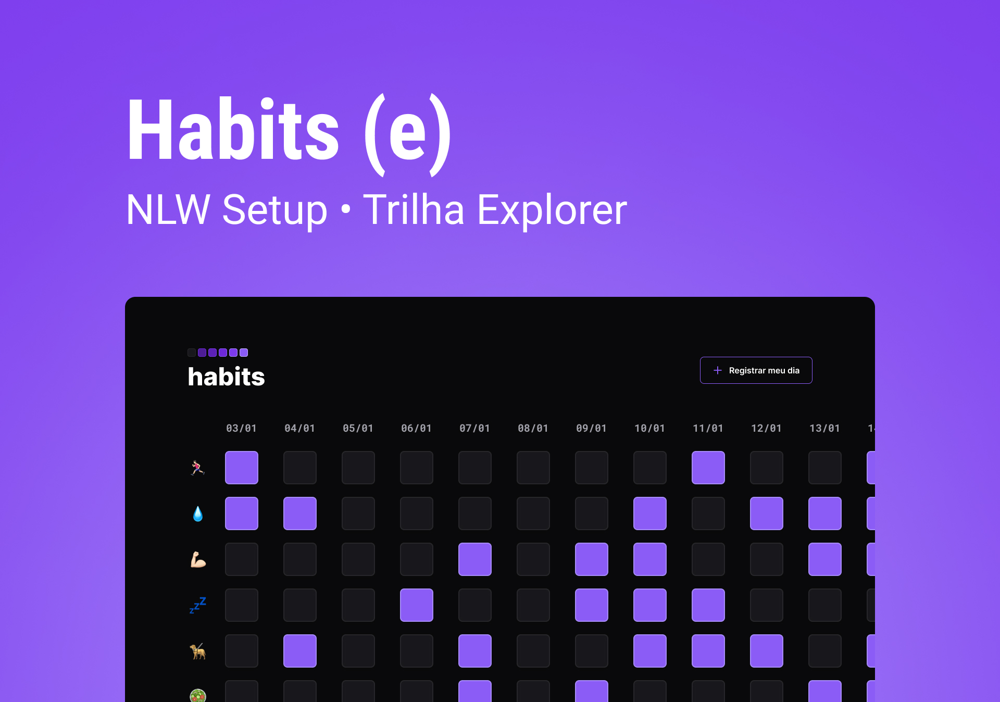

<h1 align="center"> Habits </h1>

Este projeto foi desenvolvido durante o evento promovido pela Rocketseat.  

  

## Tecnologias

- HTML e CSS
- JavaScript
- Git e Github
- Figma

## Projeto

O Habit é um app para ajudar a rastrear os hábitos.

## Licença

Esse projeto está sob a Licença MIT.
